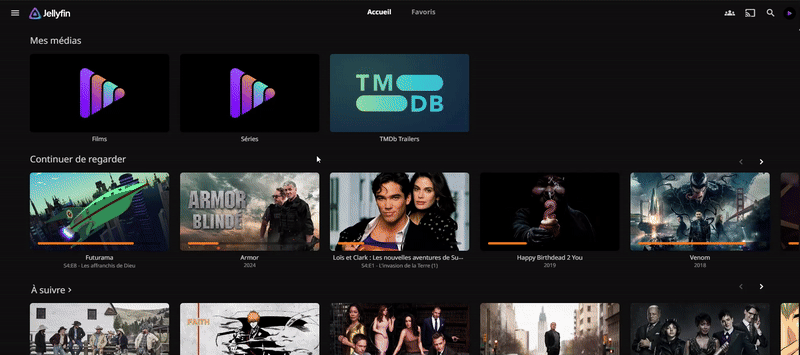
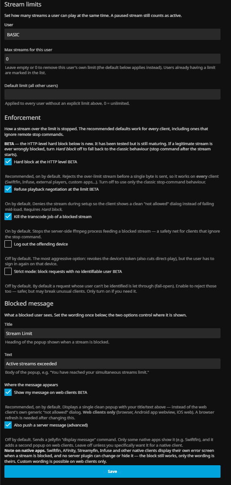

# Jellyfin Stream Limiter Plugin


Limit the number of simultaneous streams per user on your Jellyfin server — with a hard block that works on **every** client.

## Compatibility

| Jellyfin server | Plugin version | Build |
|---|---|---|
| **10.11.0 → 10.11.x** | `1.1.0.x` | `net9.0` |
| **12.0 / 12.1** | `1.1.1.x` | `net10.0` |

One manifest serves both: your server installs the right build automatically. Same features on both lines.

> ⚠️ **BETA** — the HTTP-level hard block and the custom web message (v1.1+) ship enabled by default. Each can be turned off in the settings to fall back to the classic behaviour.

## Installation

1. **Dashboard → Plugins → Repositories → +**, and add:
   ```
   https://raw.githubusercontent.com/JellyboxAD/Jellyfin.Plugin.StreamLimit/main/manifest.json
   ```
2. **Catalog → Stream Limiter → Install**, then restart Jellyfin.
3. **Dashboard → My Plugins → Stream Limiter** to set your limits.

Installing from the repository is recommended: you get automatic updates and the plugin logo. A manual install (zip from the [releases](../../releases) extracted into the server's `plugins` folder) works too, but has no logo and no auto-update.

## Features

- 🎮 **Per-user limits**, plus a **default limit** for everyone else
- 🚧 **Hard block at the HTTP level** *(BETA)*: media requests over the limit get `403` before a single byte is served. A stream that is never served cannot be played, whatever the client (native apps, Infuse, external players, custom apps).
- 🙅 **Clean refusal at setup** *(BETA)*: `PlaybackInfo` answers "playback not allowed", so clients fail before loading instead of spinning
- 💬 **Your own message on web clients** *(BETA)*: one popup with your title/text instead of the generic dialog, in every language
- 🛑 **Reactive safety net**: stop command → server-side transcode kill → optional device logout
- 👻 **No ghost lockouts**: a crashed client that stopped reporting playback frees its slot after 3 minutes
- 🔁 **Automatic migration** of pre-1.1 configurations
- 🔒 **Admin-only management API**

## Example



## Configuration



Defaults are safe: install, set a limit, done.

**Stream limits**
- **Per-user limit**: pick a user and set their max simultaneous streams. Empty or `0` removes the entry (the default applies).
- **Default limit**: applies to every user without an explicit limit. `0` = unlimited.
- A paused stream still counts as active.

**Enforcement**

| Option | Default | What it does |
|---|---|---|
| Hard block at the HTTP level *(BETA)* | on | Rejects over-limit media requests before any byte is served. Off = classic stop-command behaviour only. |
| Refuse playback negotiation *(BETA)* | on | Denies the stream during setup (`PlaybackInfo`). Requires the hard block. |
| Kill transcode jobs | on | Stops the server-side ffmpeg job of a blocked stream. |
| Log out the offending device | off | Revokes the device token. Most aggressive: the user must sign in again on that device. |
| Strict mode *(BETA)* | off | Also rejects media requests whose user cannot be identified. Off = those are let through (fail-open). |

**Blocked message**
- **Title / Text**: your wording, shown when a stream is blocked.
- **Show my message on web clients** *(BETA, on)*: replaces the web client's "not allowed" dialog with your popup (browser, Android app, iOS app). Turning it on/off needs a **server restart**; title/text changes only need a browser refresh.
- **Also push a server message** *(off, advanced)*: sends a Jellyfin `DisplayMessage` command. Only some native apps show it, and it adds a second popup on web clients.

> **Upgrading from 1.0.x?** Nothing to do: on first start the plugin migrates your configuration (legacy dashed user ids and corrupted entries are cleaned automatically).

## Client behaviour

Every client is blocked by the hard block. What the user *sees* depends on the app — no server plugin can change a native app's UI.

| Client | What the user sees when blocked |
|---|---|
| Jellyfin Web (browser) | Your custom popup |
| Jellyfin Android / iOS apps | Your custom popup (web UI); the native Android player may show an empty player |
| Swiftfin | Generic "Unable to load this item" error |
| Streamyfin | "Failed to get the stream URL", or an endless loader with the mpv engine |
| AFinity | Playback stalls without a message |
| Infuse / external players | Their own playback error |

Downloaded/offline items play from the device and cannot be blocked by the server.

## How it works

**Hard block.** A global request filter inside the Jellyfin server matches every media request (progressive `stream`, HLS playlists and segments, universal audio, Live TV, `/Items/{id}/File` and `/Download`) to a playback *slot* per user and device:

- a device already streaming keeps its slot (item switches, quality changes and seeks are not new streams);
- a new device beyond the limit gets **`403`**, with an `X-StreamLimit: 1` header — no media bytes are ever served;
- `PlaybackInfo` returns `ErrorCode: NotAllowed` at the limit;
- slots free up when the client reports a stop, when its session ends, or after 60 s without traffic; a session that stopped checking in for 3 minutes no longer counts;
- theme songs and backdrop videos played while browsing never hold a slot;
- requests that cannot be attributed to a user (API keys, anonymous) are never blocked, unless strict mode is on.

**Web message.** At startup the plugin adds a `<script>` tag to the web client's `index.html` (idempotent, reapplied after every server/web update, compatible with a server BaseUrl). The script detects a block (`X-StreamLimit` header or `PlaybackInfo` error), shows one popup with your title/text and hides the client's own error dialog. If the web folder is not writable, the client simply shows its built-in dialog — the block itself is never affected.

**Reactive safety net.** When a playback start still goes over the limit, the plugin stops the newest stream: stop command → transcode kill → optional server message → optional device logout. It counts one stream per device, and only sessions that reported playback in the last 3 minutes, so a crashed client can't get your new stream killed.

## Troubleshooting

| Symptom | Cause / fix |
|---|---|
| Plugin disabled, log says *"references an incompatible version of one of the shared libraries"* | Fixed in `1.1.0.1` (issue #19): update the plugin and restart. |
| Plugin logo missing on Jellyfin 12, disable/uninstall buttons fail | Fixed in `1.1.1.1`: update the plugin and restart. |
| No logo after a manual install | Expected: Jellyfin only downloads the logo when installing from the repository. |
| Custom web message not shown | Check the log for a write warning on `index.html` (read-only web folder, e.g. some Docker setups). Restart the server after toggling the option, then refresh the browser. |
| Limit not applied | Check the user's effective limit with `GET /StreamLimit/GetUserStreamLimit?userId=<id>` and the server log (entries from `Jellyfin.Plugin.StreamLimit`). |

## API

Management endpoints require **admin** permissions:

```http
GET  /StreamLimit/GetUserStreamLimit?userId=<id>
     → { "userId": "<dashless-id>", "streamsAllowed": <effective>, "explicitLimit": <n|null> }
GET  /StreamLimit/GetAllStreamLimits
     → { "defaultMaxStreams": <n>, "limits": { "<dashless-id>": <n>, ... } }
POST /StreamLimit/SetUserStreamLimit?userId=<id>&streamsAllowed=<n>
     → sets the user's limit; 0 removes it (the default applies again)
POST /StreamLimit/SetAlertMessage?alertMessage=<text>&title=<title>
     → updates the blocked-message wording
```

One endpoint is anonymous by design (loaded by the web client before login, contains no secrets):

```http
GET  /StreamLimit/inject.js    → the web-message client script
```

User ids are accepted with or without dashes. Swagger UI: `http://your-server/api-docs/swagger` (StreamLimit section).

## Development

```bash
# Jellyfin 10.11 build
dotnet publish Jellyfin.Plugin.StreamLimit/Jellyfin.Plugin.StreamLimit.csproj -c Release -o publish/net9

# Jellyfin 12 build
dotnet publish Jellyfin.Plugin.StreamLimit/Jellyfin.Plugin.StreamLimit.csproj -c Release \
  -p:PluginTargetFramework=net10.0 -p:JellyfinVersion=12.0.0 -o publish/net10

# Tests (add the same -p: flags to test the Jellyfin 12 build)
dotnet test tests/Jellyfin.Plugin.StreamLimit.Tests/Jellyfin.Plugin.StreamLimit.Tests.csproj
```

The plugin has no external dependencies, so each release zip contains a single DLL.

Two rules keep every server able to load the plugin (both are checked by tests):

- **Build against the first release of a Jellyfin line** (`10.11.0`, `12.0.0`), never a floating `10.11.*`. The DLL records the Jellyfin versions it was compiled against, and an older server refuses a plugin that asks for a newer version (issue #19).
- **The DLL version must match the manifest version** of its build (`1.1.0.x` for 10.11, `1.1.1.x` for Jellyfin 12, both set in `Directory.Build.props`). Jellyfin uses it to build the logo and plugin-management URLs.

### Releasing

1. Bump both versions in `Directory.Build.props` and add a `### [vX.Y.Z.W]` section at the top of the changelog in `build.yaml`.
2. Commit, then push a tag: `git tag v1.1.0.2 && git push origin main v1.1.0.2`.

The release workflow then runs the tests on both builds, builds both zips, creates the GitHub release and adds the two new versions (with their checksums) to `manifest.json` on `main`.

## Contributing

1. Fork the project
2. Create a feature branch (`git checkout -b feature/AmazingFeature`)
3. Commit your changes (`git commit -m 'Add some AmazingFeature'`)
4. Push to the branch (`git push origin feature/AmazingFeature`)
5. Open a Pull Request

## License

MIT — see [LICENSE](LICENSE).

## Support

Check the [issues](../../issues) or open a new one.
